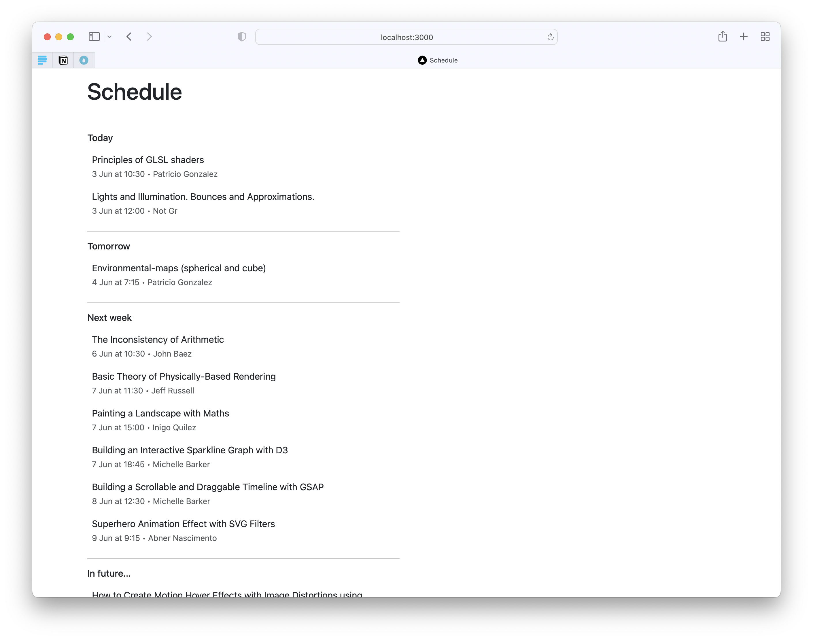

# js-react-frontend-test

In this test, you're required to regroup the schedule activities based on the following criteria:

- Group events for the current week. Separate the activities under following titles
    - Today
    - Tomorrow
    - The rest should follow the format like: Thu, May 30, Fri, May 31, ... until the week ends. Rely on `dayjs` to help
      get end of week (based on locale).

  _For activities in this group, only show the time (with the instructor) in the footer._

- Group events for the following (1) week with the title "Next week"
    - Show the day, date and instructor (Mon, May 5 • Instructor)

- Group events for the rest of the days after the following week all into one.
    - Show just date and instructor
    - Only display up to 5 activities (if even activities under this are more than 5)

- Only display a group of activities when there's at least one activity in it.

- Only activities from today onwards are provided. _Do not worry about yesterday_.

- NOTE: All activities have to be sorted in ascending order

## Expected grouping visualization

- Today
    - Activity 1
    - Activity 2

- Tomorrow
    - Activity 3

- Fri, 30 May
    - Activity 4
    - Activity 5
    - Activity 6

- Sun, 1 Jun
    - Activity 7

- Next week
    - Activity 8
    - Activity 9
    - Activity 10
    - Activity 11

- In future <- Here goes the rest
    - Activity ...
    - Activity ...

## References:

MDN: https://developer.mozilla.org/en-US/

React: https://reactjs.org

Dayjs: https://day.js.org/docs/en/